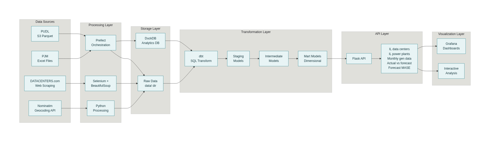
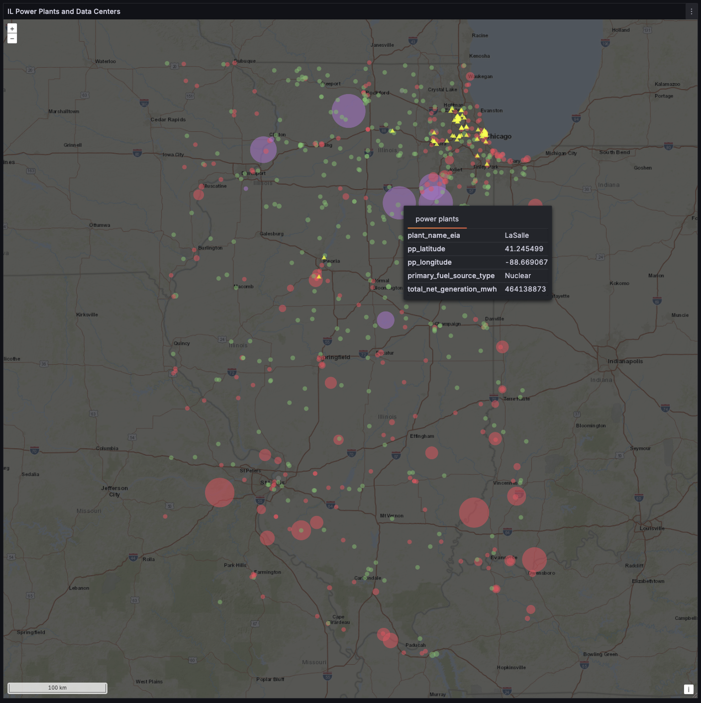
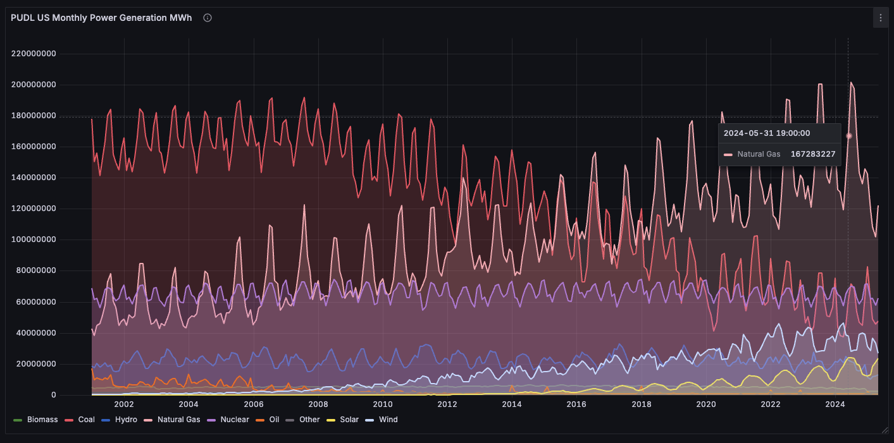
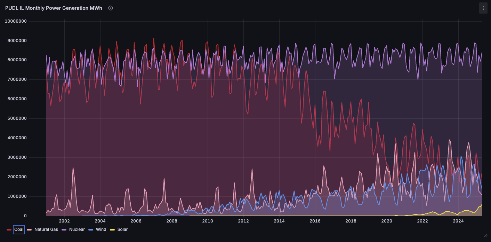
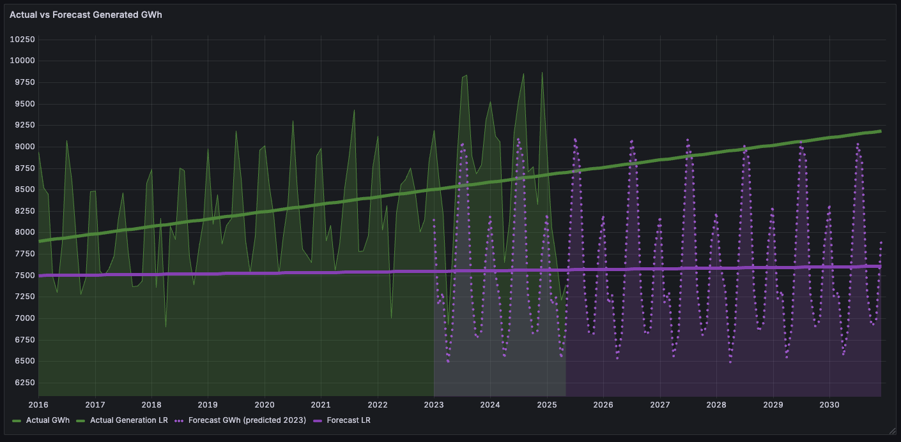
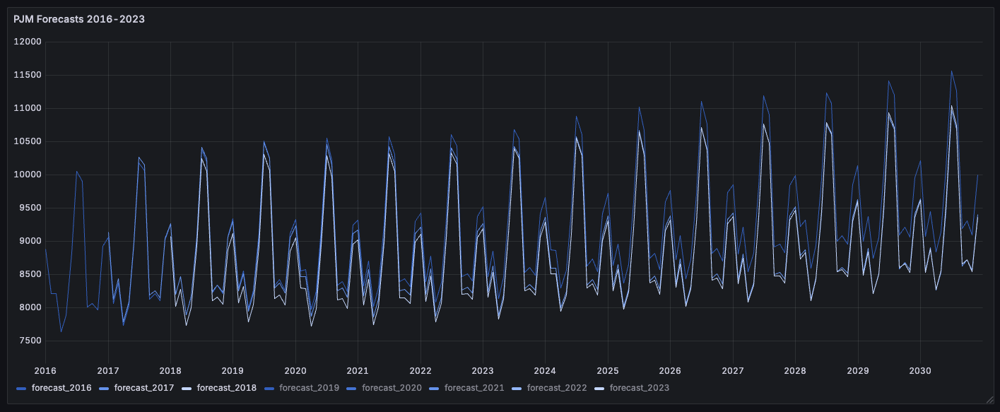
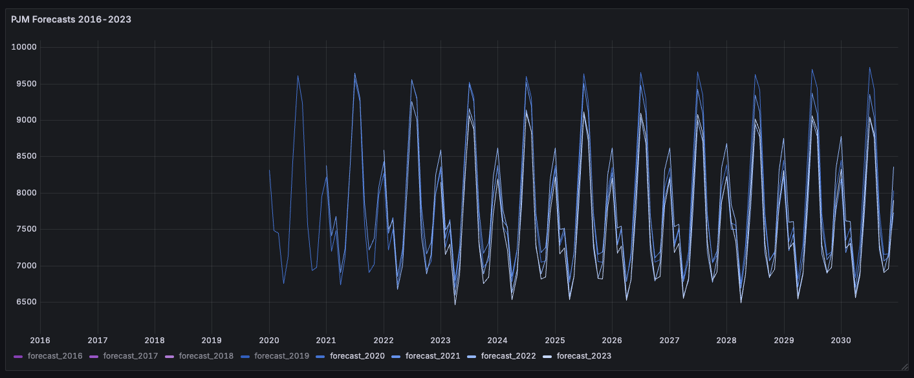

# Power Plants & Data Centers in Illinois

## Executive Summary

### Is the Illinois power grid prepared for projected data center growth?

To answer this question, we examine:

- historical electrical generation from [PUDL](https://catalystcoop-pudl.readthedocs.io/en/nightly/index.html#)
- forecasts from the managing operator [PJM](https://www.pjm.com/about-pjm)
- the existing mix of power plants and Illinois government policies
- a brief survey of recent data center construction

Based on the analysis, we can make four key observations:

> 1. Past electrical generation since 2002 in the Northern Illinois ComEd zone shows a steady, modest rise.
> 2. Hyperscaler data center growth in the Midwest is not an illusion [16]. States and consumers are feeling the price increases [18].
> 3. PJM forecasts for 2025 and beyond do NOT show an expected "AI bump" and are relatively flat, suggesting a "wait and see" approach from operators.
> 4. The flat prediction is probably wrong. ComEd might rely on nuclear to offset high demand in the immediate future--maybe 2-5 years but, operators and governments should fast-track new renewable plants now.

## Business Problem

The rapid growth of energy-intensive AI/ML technologies dominates the current energy discourse. Google Trends reveals a **fivefold increase** in searches for "[data center](https://trends.google.com/trends/explore?date=today%205-y&geo=US&q=data%20center&hl=en)" over the past five years. Media coverage highlights concerns of soaring energy bills and the possibility of grid instability [7][10][11][12]. For Illinois, maintaining a robust and resilient power grid is essential to sustaining investment and reinforcing its position as a critical national infrastructure hub.

Illinois offers a particularly instructive case study in data center expansion:

- The state ranks among the **top five global data center markets**, with Chicago tied for the **third-largest hub in the U.S.** (222 sites in Q3 2025) [15].
- Data centers in Illinois consumed approximately **5.4% of statewide electricity** as of early 2025, significantly higher than national averages [1].
- Illinois is the nation’s leading producer of **nuclear power**, generating nearly one-eighth of total U.S. nuclear electricity [2].

These dynamics underscore the importance of examining the **past, present, and future** of Illinois’ electricity system as it prepares for continued data center growth.

**PAST:**  
Historical records from [PUDL](https://catalystcoop-pudl.readthedocs.io/en/nightly/index.html#) (pronounced _puddle_) provide decades of monthly generation data at national and state levels. Developed by [Catalyst Cooperative](https://catalyst.coop/), PUDL consolidates, cleans, and standardizes widely used public datasets. _This long-term record allows direct analysis of generation capacity and mix in Illinois since the early 2000s._

**PRESENT:**  
Indicators suggest that pressure on the Illinois grid is already materializing. Analysts cite rising consumer costs, water usage concerns, and capacity constraints [10][11][12]. Forecasts by Synapse point to a near-term **8% price increase**. Additionally, policymakers in PJM states are increasingly vocal about the financial impacts of data center demand on electricity markets [7]. _The breadth and frequency of these warnings suggest that current risks, while unevenly distributed, are both tangible and escalating._

**FUTURE:**  
Illinois is part of the [PJM](https://www.pjm.com/about-pjm) interconnection, a multi-state regional transmission operator. PJM does not generate power; rather, it functions as the **traffic control system** for electricity, balancing supply and demand to prevent outages and price volatility. Within the COMED (Commonwealth Edison) zone in Northern Illinois, PJM plays a critical role in integrating future data center growth. Looking ahead, transparency will increase with the passage of **SB2181**, which requires data centers to disclose site-level energy and water consumption starting in 2026 [5]. _Coupled with PJM’s multi-year demand forecasts, these data sources provide a foundation for assessing Illinois’ readiness under different growth scenarios._

## Tech Stack Overview

#### Data Sources

- [The Public Utility Data Liberation (PUDL) Project](https://catalyst.coop/pudl/) — open-source U.S. electricity sector data
- [PJM](https://www.pjm.com/) — regional coordinator of electricity in all or parts of 13 states and D.C.
- [DATACENTERS.com](https://www.datacenters.com/) — searchable directory of U.S. data centers
- [Nominatim](https://nominatim.org/) — open-source geocoding API service

#### Stack

| Technology                            | Usage                                                                                                  |
| ------------------------------------- | ------------------------------------------------------------------------------------------------------ |
| [Python](https://www.python.org/)     | Expecting Visual Basic? All workflows and tools where chosen to be Python-centric                      |
| [DuckDB](https://duckdb.org/)         | Fast, portable local database optimized for analytical workflows in data science                       |
| [Selenium](https://www.selenium.dev/) | Open-source automation framework for web browsers                                                      |
| [dbt](https://www.getdbt.com/)        | Open-source command-line tool for modeling transformations and objects in SQL                          |
| [Prefect](https://www.prefect.io/)    | Pythonic open-source framework for orchestrating, scheduling, and monitoring data workflows            |
| [Grafana](https://grafana.com/)       | Open-source platform for creating interactive dashboards and visualizing metrics, logs, and other data |

#### Data Engineering?

Honestly, there wasn't much need for the "T" in ETL or much integration It's not that kind of DE project :)

The team at [Catalyst](https://catalyst.coop/pudl/) have already done the work of reconciling EIA data using [Dagster](https://dagster.io/) instead of Prefect and hosting it on S3 in parquet format. They're also using dbt in an [interesting way](https://catalystcoop-pudl.readthedocs.io/en/latest/autoapi/pudl/dbt_wrapper/index.html#pudl.dbt_wrapper.dagster_to_dbt_selection) to track invocations.

PJM's data access leaves much to be desired. They have robust trading-centric web apps--perhaps they have internal APIs that members can access?

If I had to track power generation for PJM, I would try to unify ComEd SCADA output using a more industry-standard tool like Apache Airflow. Ironically, there would probably be some RAG in the pipeline. It will be interesting to se what reporting standards emerge with Illinois SB2181.

## Installation & Quickstart

#### PREREQUISITES:

- **Python**: I used v3.13.7; anything from 3.10+ will probably work.

- **Git**: 2.51 was used for this project. 2+ should work.

- **Grafana**: homebrew: `brew install grafana` `brew services start grafana`

- **uv**: (sort of optional, but highly recommended) `brew install uv` or `pipx install uv`

#### SETUP:

**1. Clone the repo**:

`git clone git@github.com:rbhughes/power_puddle.git`

**2. Install project dependencies**

`uv sync` _(or install libs in pyproject.toml if you prefer pip)_

**3. Setup dbt dependencies**

(within the project's dbt/ folder, `cd dbt`)
`uv run dbt deps`

**4. Run Prefect flows**

_If you don't care about the 150+ data center locations on the map (they're not part of the analysis) or you want to avoid Selenium, comment it out in `flows.etl_flows` before running._

`uv run --project . python -m flows.etl_flows`

**5. Build dbt models**

(again, from within dbt/)
`uv run dbt run`

To selectively (re)run a model after modifying

`uv run dbt run --select int_actual_vs_forecast`

**6. Start the Flask API for Grafana**

The port is set to 5500 by default. Change it in `api/puddle_api.py`.

`uv run --project . python -m api.puddle_api`

Test a route in your browser:
`http://localhost:5500/api/us-monthly-generation`

**7. Import visualizations into Grafana**

I'll leave this as an exercise for the reader. It is likely that some incompatibility in the JSON formats will have crept in for open source Grafana, but exports of the visualizations and dashboards in this repo are in `grafana/dashboards`.

## Architecture Diagram

- #### Data Sources

  The pipeline integrates four distinct data sources - PUDL parquet files from S3 for historical power generation data, PJM Excel files for demand forecasts, web-scraped data center information from DATACENTERS.com, and geocoding services from Nominatim.

- #### Processing & Orchestration

  Prefect orchestrates the entire workflow, coordinating data collection, web scraping with Selenium, and Python processing scripts. This demonstrates modern data engineering practices with proper workflow management.

- #### Storage Strategy

  DuckDB serves as the central analytical database, chosen for its native parquet support and simplicity for analytical workloads. Raw data is staged in the data/ directory before processing.

- #### Transformation Pipeline

  The dbt transformation layer implements a clean staging-intermediate-marts architecture, handling the complex task of merging nuclear generation data (reported separately by EIA) with other fuel sources, then creating dimensional models for analysis.

- #### API & Visualization
  A Flask API provides six endpoints that serve JSON data to Grafana dashboards, enabling interactive visualization of power plant locations, generation trends, and forecast accuracy analysis.

## Workflow Steps

Most steps are orchestrated with Prefect. See the [Prefect flows](flows/etl_flows.py) for technical details. DuckDB was chosen for its native parquet support and simplicity.  
_PostgreSQL was a close runner-up, but my dev environment was configured for an older version that I didn't want to break._

---

**1. Collect PJM data**

The PJM site has basic search and download features. The forecast files required are available as Excel files (.xls or .xlsx) with inconsistent naming. Download the relevant files to the [data directory](data/pjm/).

> Note: `<year>-load-report-data.xlsx` files contain forecast data for the publication year and several years ahead. These are used for COMED forecasts. The `*stage-1-resources-by-zone*` files, once considered for linking PJM and PUDL plant names, were too unreliable for use.

---

**2. Initialize PUDL tables**

Load the parquet files from the PUDL distribution’s S3 site into your local DuckDB database. These contain power plant locations and monthly historical generation data for all states. Nuclear generation data is managed separately and merged later.

| PUDL                                        | DuckDB                      |
| ------------------------------------------- | --------------------------- |
| core_eia\_\_entity_plants                   | puddle.main.plants          |
| core_eia\_\_monthly_generation_fuel_nuclear | puddle.main.monthly_gen_nuc |
| core_eia\_\_monthly_generation_fuel         | puddle.main.monthly_gen     |

---

**3. Collect Data Center info**

Scrape data center names and street addresses from datacenters.com using Selenium and BeautifulSoup. The site imposes rate limits and has tricky pagination. After obtaining addresses, use Nominatim for geocoding (lat/lon).

> These locations are not used for primary analysis but highlight that nearly all 154 are in Northern IL (within the COMED zone), while Southern IL coverage is sparse.

---

**4. Run dbt workflows**

- **Staging:**  
  Merge monthly generation from nuclear and other sources (solar, natural gas, oil, etc.), standardizing the `fuel_type_code_pudl` values as `fuel_category`.
- **Intermediate:**  
  Perform a union of `monthly_gen` and `monthly_gen_nuc` since nuclear MWh is reported separately by the US EIA.
- **Marts:**

| model                                 | purpose                                  |
| ------------------------------------- | ---------------------------------------- |
| `dim_data_center.sql`                 | list from datacenters.com + lat/lon      |
| `dim_fuel.sql`                        | standardize `fuel_type_code_pudl` values |
| `dim_plant.sql`                       | power plant metadata from PUDL           |
| `fact_generation.sql`                 | group generation by plant                |
| `mart_actual_vs_forecast.sql`         | MWh from PUDL vs. forecasts from PJM     |
| `mart_monthly_generation_summary.sql` | all US (and IL) historical PUDL MWh      |

---

**5. Flask/Blueprint API**

Grafana is used for visualization and analysis. It does not natively connect to DuckDB but can consume JSON from APIs. Endpoints reference the dbt models and are served via a local Flask app—ideal for iterative development and avoids handling intermediate CSV files or PostgreSQL setup.

Defined routes:

| route                      | description                          |
| -------------------------- | ------------------------------------ |
| `/il-data-centers`         | data center names, lat/lon           |
| `/il-power-plants`         | power plants with net MWh generation |
| `/us-monthly-generation`   | US monthly generation time-series    |
| `/il-monthly-generation`   | IL monthly generation time-series    |
| `/actual-vs-forecast`      | PUDL generation vs PJM forecasts     |
| `/actual-vs-forecast-mase` | Mean Absolute Scaled Error scores    |

---

**6. Define Grafana Visualizations**

Grafana is run locally via Homebrew. Visualizations use the Flask API routes described above.

## Results & Insights

### IL Power Plants & Data Centers

> The distinction between the ComEd region in Northern Illinois and the southern half of the state is significant. Large fossil-fuel plants (red) are concentrated mostly in the south, while nuclear power (purple) dominates in the north. Data centers (yellow) are highly clustered near Chicago.

---

### US Generation Mix

> This time-series chart displays US monthly generation since 2002. Key trends include:
>
> - The gradual decline of coal
> - The rise and dominance of natural gas
> - General stability of nuclear power
> - Steady but slower growth in renewables, primarily wind and solar

---

### IL Generation Mix

> Northern Illinois's robust nuclear capacity sets it apart from other US regions. While this chart does include southern Illinois fossil-fuel plants, the magnitude of nuclear's impact is obvious. The state's nuclear moratorium has recently been updated, paving the way for small nuclear plant deployment [14].
>
> Note the relatively modest contribution of natural gas in Illinois compared to the national picture. While Illinois is a major natural gas consumer with extensive pipeline infrastructure, future energy policy is expected to emphasize wind and solar over new gas-fired plants [7].

---

### IL ComEd Actual (PUDL) vs Forecast (PJM)

> Analyzing the PUDL and PJM datasets side-by-side reveals surprising results. The PUDL data (green) shows actual MWh generated for all ComEd counties in Northern Illinois. PJM data (purple) reflects the latest published forecasts for upcoming years.
>
>  > 
>
> Forecasts from 2016–2018 appeared to project modest growth. In contrast, more recent forecasts from 2019–2023 are noticeably flat, lacking any anticipated surge in demand. Despite widespread warnings about looming grid failures and price shocks attributed to data centers, **the latest PJM forecasts still project minimal or no increase in future demand**. The linear trend looks nearly flat. PJM itself acknowledges possible underestimation of hyperscale data center impacts in the ComEd zone [17]. The absence of even modest projected growth is puzzling.
>
> _Note: 2023 forecast is from PJM; the 2024 Excel file was corrupted and could not be included._

---

#### Forecast Accuracy: Mean Absolute Scaled Error (MASE)

I attempted to calculate a Mean Absolute Scaled Error to see if their forecast accuracy had measurably changed over the past few years, and it does suggest increasing error.

<table>
<tr>
<td>

| forecast year | MASE score |
| ------------- | ---------- |
| 2016          | 1.14       |
| 2017          | 1.03       |
| 2018          | 0.78       |
| 2019          | 0.69       |
| 2020          | 1.39       |
| 2021          | 1.27       |
| 2022          | 1.56       |
| 2023          | 1.93       |

</td>
<td>

<pre>
MASE (Mean Absolute Scaled Error)** is a forecast accuracy metric:

- MASE 0.7 — model's error is 70% of the naïve error (good).
- MASE 2.2 — model's error is more than double the naïve forecast (poor).
- Lower scores are better; scores below 1 are ideal.

MASE is scale-independent. Changes in magnitude, actuals, or variance affect both the error numerator (average absolute forecast error) and denominator (average absolute naïve error) proportionally.
</pre>

</td>
</tr>
</table>

---

> [!Caution]
> For complete accuracy, this comparison would require plant-by-plant PUDL data mapped precisely to PJM’s forecast input list for the ComEd zone. That data is not publicly available. Attempts to fuzzy-match plant names across PJM and PUDL were inconsistent. Other complicating factors include interconnections, occasional non-PJM supply at times of peak demand, new generator additions/retirements, and scheduled outages. The chosen method uses all Northern Illinois counties assigned to ComEd as the “actual” filter, with PJM forecasts left unadjusted.

## References, Endnots & Further Reading

1. [Brighlio: Illinois Data Centers Offer High Security, Efficiency](https://brightlio.com/data-centers-in-illinois/)  
   Summary: Overview of major Chicago-area data centers, highlighting their sustainable design, high security, and industry certifications for reliable and efficient operations.

2. [EIA: One-Page Illinois Energy Data Snapshot](https://www.eia.gov/state/analysis.php?sid=IL)  
   Summary: Comprehensive state energy profile including generation mix, electricity prices, top industries, and historical trends from the U.S. Energy Information Administration.

3. [IL General Assembly: Nuclear Reactors Law Lifts Small Plant Ban](https://ilga.gov/documents/legislation/publicacts/103/PDF/103-0569.pdf)  
   Summary: Details 2023 Illinois law partially lifting the ban on new nuclear plant construction, specifically permitting small modular reactors under 300 MW.

4. [Illinois Policy: Nuclear Growth Potential Despite Moratorium](https://www.illinoispolicy.org/nuclear-energy-gives-illinois-economic-power-if-it-will-allow-new-plants/)  
   Summary: Argues that Illinois can harness significant economic benefits from expanding nuclear energy if policy restrictions are further relaxed.

5. [IL SB2181: New Data Center Energy Reporting Requirement](https://www.ilga.gov/Legislation/BillStatus?DocTypeID=SB&DocNum=2181&GAID=18&SessionID=114&LegID=161884)  
   Summary: Illinois legislation mandating state agencies report on large data center power usage for improved grid planning.

6. [PJM: Board Fast-Tracks ‘Critical Issue’ Process for Data Centers](https://www.pjm.com/-/media/DotCom/about-pjm/who-we-are/public-disclosures/2025/20250808-pjm-board-letter-re-implementation-of-critical-issue-fast-path-process-for-large-load-additions.pdf)  
   Summary: PJM’s board launches an accelerated rulemaking track to address dramatic growth in data center electricity demand, targeting new reliability and interconnection standards.

7. [Reuters: Governors Demand Greater Say in PJM Grid](https://www.reuters.com/business/energy/governors-push-more-sway-over-biggest-us-grid-power-bills-surge-2025-09-22/)  
   Summary: More than a quarter of U.S. state governors seek more control over PJM, citing soaring electricity prices fueled by surging AI data center demand.

8. [SiteSelection: Illinois Remains a Top Data Center Location](https://siteselection.com/crunching-the-numbers/)  
   Summary: Analysis of Illinois’s national standing as a leading U.S. data center destination, with factors including incentives, infrastructure, workforce, and market activity.

9. [Small Nuclear Reactors Now Allowed in Illinois](https://ilga.gov/documents/legislation/publicacts/103/PDF/103-0569.pdf)  
   Summary: Law permitting new small modular nuclear reactors, ending Illinois’ total ban on new nuclear sites.

10. [Synapse: Illinois Data Center Growth Risks (Slide Deck)](https://www.synapse-energy.com/sites/default/files/IL%20Data%20Center%20results_2025.05.05%20Edits%20FINAL%2025-033.pdf)  
    Summary: Slides quantifying how rapid new data center load will boost Illinois and PJM grid demand, pushing total loads and requiring major new energy infrastructure by 2040.

11. [Synapse: Illinois Data Center Load Growth Risks (Fact Sheet)](https://www.synapse-energy.com/sites/default/files/IL%20Data%20Center%20fact%20sheet_2025.04.30%2025-033.pdf)  
    Summary: Brief describing a projected 30% increase in ComEd’s grid load from data centers by 2040, driving up residential bills 8.3% and boosting CO2 emissions by 64% in the region.

12. [Synapse: PJM Data Center Growth Raises Regional Bills](https://www.sierraclub.org/sites/default/files/2025-03/pjmdatacentermodelingresults_dec2024.pdf)  
    Summary: PJM-wide analysis finds large anticipated increases in load, peak demand, and emissions from rapid data center buildout, raising residential electricity bills.

13. [Synapse: State of Illinois Energy System—2025 Landscape](https://www.synapse-energy.com/sites/default/files/A%20Snapshot%20of%20the%20Energy%20Landscape%20in%20Illinois_Synapse%20report%20for%20IMA%2024-134.pdf)  
    Summary: Deep-dive report on Illinois energy trends, policies, decarbonization goals, and forecasted demand scenarios, including data center and electrification load impacts.

14. [TGS: Oil Revitalization and Data Center Expansion in Illinois Basin](https://www.tgs.com/weekly-spotlight/09-08-2025)  
    Summary: Outlines how massive regional oilfield redevelopment projects and hyperscale data center construction are reshaping the Illinois Basin’s economic and energy future, with integrated geoscience datasets supporting both.

15. [Brighlio: Illinois Rises as Colocation and Hosting Hub](https://brightlio.com/data-centers-in-illinois/)  
    Summary: Summarizes key players and facility features drawing major cloud and tech clients to Illinois’s data center market.

16. [Whitecase: Large Pipeline of Hyperscaler project in PJM](https://www.whitecase.com/insight-alert/grid-operators-propose-innovative-measures-manage-electricity-demand-data-centers)  
    Summary: Concrete growth through 2030 is now fully backed by utility/grid agreements, not projections or speculation

17. [PJM: Long Term Load Forecasts](https://www.pjm.com/-/media/DotCom/planning/res-adeq/load-forecast/2025-long-term-load-forecast-supplement.pdf)  
    Summary: Slow large-load reporting, model lag, and the difficulty of distinguishing “hyperscale” facilities from standard commercial uses makes modelling forecasts difficult

18. [UtilityDive: PA Governor threatens to leave PJM](https://www.utilitydive.com/news/governors-states-pjm-governance-conference-capacity/760842/)  
    Republican and Democratic governors of PJM Interconnection states on Monday threatened to pull out of the grid operator’s markets unless states are given a role in governing the organization.
